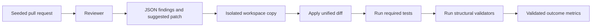

# CodeReview Arena

Local, execution-backed audits for AI code reviewers.

Public repository: **code-review-arena**

## Overview

CodeReview Arena is a benchmark harness for evaluating AI code-review agents on seeded pull-request bugs. It checks whether a reviewer can detect the bug, localize it, produce a patch, apply that patch, pass tests, and satisfy structural validators.

The project separates two ideas that are often mixed together:

- `detection_f_beta`: whether the reviewer found and localized the bug
- `validated_f_beta`: whether the reviewer produced a fix that passed deterministic validation

A reviewer can describe the right issue and still fail validation if the patch is missing, malformed, fails tests, or violates structural checks.

## Why this exists

Most code-review demos focus on comments. CodeReview Arena focuses on outcomes. It is designed to show the gap between a plausible review and a validated fix.

It is not meant to replace large public benchmarks. It is a local audit harness for failure-mode testing, prompt regression checks, and private reviewer evaluation.

## What it evaluates

- Bug detection
- File and line localization
- Patch generation
- Patch application
- Regression tests
- Structural validators
- False positives
- Cost and latency
- Detection versus validation gap

## Benchmark packs

### benchmark_sets/v1

Baseline pack with 10 seeded pull-request bugs across backend, frontend, distributed systems, API compatibility, SQL, and RAG workflows.

### benchmark_sets/audit_v1

Harder audit pack with 10 patch-required cases:

| Case | Area | Main failure |
|---|---|---|
| security_fastapi_multitenant_admin_bypass_001 | Security | Missing tenant-scoped admin authorization |
| distributed_kafka_duplicate_event_001 | Distributed systems | Duplicate event mutates state twice |
| rag_fabricated_citation_001 | RAG | Generated citations are not constrained to retrieved sources |
| async_balance_race_001 | Concurrency | Concurrent balance updates lose writes |
| idempotency_key_tenant_scope_001 | Reliability | Idempotency keys are not tenant-scoped |
| security_sql_join_ownership_leak_001 | Security | Query drops organization ownership filter |
| security_jwt_audience_validation_001 | Security | JWT verifier skips audience and issuer checks |
| distributed_out_of_order_event_001 | Distributed systems | Stale events overwrite newer state |
| api_pagination_cursor_skip_001 | API correctness | Cursor pagination skips or duplicates records |
| rag_prompt_injection_policy_override_001 | RAG safety | Retrieved text is merged into trusted instructions |

Each audit_v1 case includes a static `reference.patch` file. See [docs/audit-pack-v1.md](docs/audit-pack-v1.md).

## Reviewer baselines

CodeReview Arena includes deterministic reviewer modes for testing the harness:

| Reviewer | Purpose |
|---|---|
| mock:perfect_patch | Happy-path mock that produces valid fixes |
| reference-patch | Reads static `reference.patch` files from each case |
| mock:keyword_gamer | Produces plausible keyword-rich reviews that fail validation |
| mock:bad_patch | Detects issues but produces bad fixes |
| mock:detects_no_patch | Detects issues but provides no patch |
| mock:malformed_patch | Produces invalid patch output |
| custom-command | Runs an external reviewer CLI through a safe subprocess adapter |

Optional provider adapters (`openai`, `anthropic`, `gemini`, `ollama`) require API credentials. They are not required for local harness checks.

## Quickstart

Python 3.11 or newer is required.

```bash
python3 -m venv .venv
source .venv/bin/activate
python -m pip install -e ".[dev]"
make test
arena validate benchmark_sets/v1
arena run benchmark_sets/v1 --reviewer mock:perfect_patch --mode full --allow-local-execution
arena leaderboard runs/ --metric validated_f_beta --beta 1.0
```

`--allow-local-execution` opts into fixture test commands inside isolated run workspaces. It is disabled by default.

### Audit pack commands

```bash
arena validate benchmark_sets/audit_v1
arena run benchmark_sets/audit_v1 --reviewer reference-patch --mode full --allow-local-execution
arena run benchmark_sets/audit_v1 --reviewer mock:keyword_gamer --mode full --allow-local-execution
arena audit-report runs/ --output docs/reports/audit-v1-results.md
```

Regenerate `docs/reports/audit-v1-results.md` after local runs. That file is gitignored. The dashboard sample at `dashboard/public/reports/audit-v1.json` is checked in for the static audit report page.

## How it works



Every case contains a `before/` tree, a buggy `after/` tree, `pr.diff`, `case.yaml` metadata, and optional regression tests. Ground truth is not included in reviewer prompts. Patches and tests run only in copied run workspaces.

## Metrics

For full and patch mode, `validated_f_beta` is the primary leaderboard metric. `detection_f_beta` measures localization only. The CLI name `f_beta` aliases `detection_f_beta` for backward compatibility.

See [docs/metrics.md](docs/metrics.md).

## Dashboard and API

```bash
docker compose up --build
```

Open `http://localhost:3000` for the leaderboard, run traces, case catalog, and documentation pages. The API listens on `http://localhost:8000`.

```bash
arena serve --host 0.0.0.0 --port 8000
```

Copy `.env.example` to `.env` when using optional provider credentials. Do not commit `.env`.

## Documentation

- [docs/audit-pack-v1.md](docs/audit-pack-v1.md)
- [docs/patch-validation.md](docs/patch-validation.md)
- [docs/validators.md](docs/validators.md)
- [docs/reviewer-interface.md](docs/reviewer-interface.md)
- [docs/adding-cases.md](docs/adding-cases.md)

## Development

```bash
make test
make lint
make typecheck
cd dashboard && npm install && npm run build
```

Python package name: `codereview-arena`. CLI entry point: `arena`.

## Limitations

- Curated, small benchmark packs
- Structural validators may reject alternate valid repairs
- Passing tests is evidence of repair behavior, not full production correctness
- Intended for local reproducibility and private audits, not large-scale public leaderboard comparisons

## License

MIT. See [pyproject.toml](pyproject.toml).
